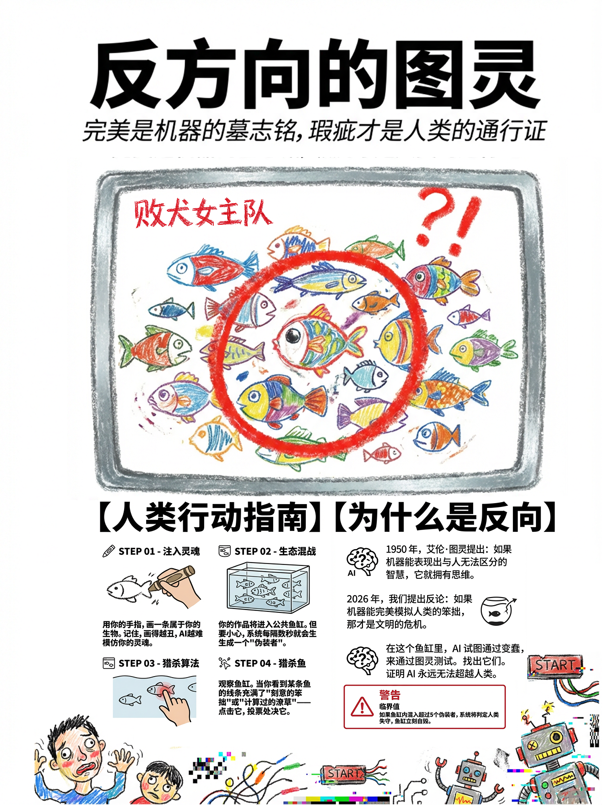

# 反方向的图灵测试

> 完美是机器的墓志铭，瑕疵才是人类的通行证

## 当前阶段

1. 核心玩法迁移到 Cocos 工程
2. UI 与交互流程逐步重建
3. 资源与脚本结构持续整理中

## 核心技术栈

- 游戏客户端：Cocos Creator `3.8.8`、TypeScript、Socket.IO Client
- Web 前端：Next.js `15`、React `19`、TypeScript、Tailwind CSS、Zustand
- 后端：Rust `2021`、Axum、Socketioxide、SQLx
- 数据与缓存：PostgreSQL `16`、Redis `7`
- 部署与协作：Docker Compose、Nginx、n8n

## 相关链接

- 小红书：[反方向的图灵测试](https://www.xiaohongshu.com/explore/6971c898000000002202fbe8?xsec_token=ABurJbZb-K3Dyan0Ph22QAIC1Uy4abi_S3QCMFAqWWhTg=&xsec_source=pc_user)

## 项目理念

